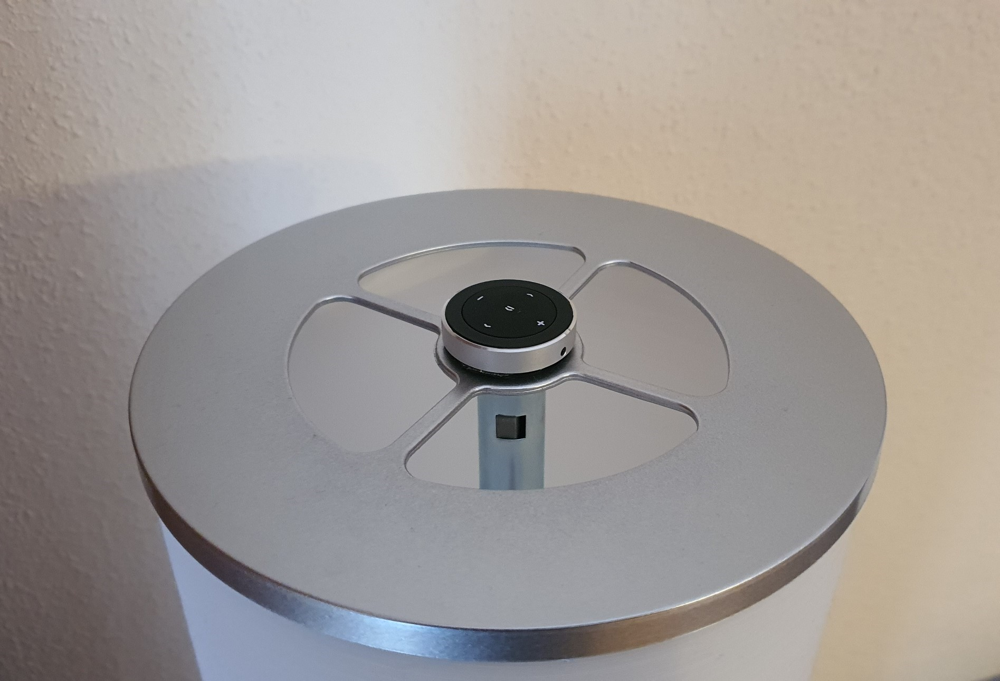

### Meross Controllers
#### Set of (two) programs to control devices connected to a Meross plug
Control your Meross plugs in two differet ways: 

 - By pressing a button, with a cheap bluetooth button 
 - Automatically turn off laptop power when not in use

#### Controller #1: button-controller
This can be used to switch on and off a Meross plug by pressing any key of a bluetooth button. I use and unexpensive [Satechi Media Button](https://www.amazon.com/Satechi-Bluetooth-Button-compatible-Samsung-Media/dp/B00RM75NL0/). 

As in the photo, you can stick the button to the lamp or device you want to control. With this controller it is possible to switch a device both by voice commands (with Alexa or Google Home) and by pressing a switch , whatever is more handy for the moment, and you won't cut the electricity flow to the meross plug as happens if you use the cable switch of the lamp.

There are many solutions for intelligent switches but they usually need aditional hubs and are much more expensive.

The Satechi Media Button has 5 media keys as it is intended to be used to control audio playback. This controller will ignore what media button is pressed and will allways toggle the plug on and off.

#### Controller #2: ip-controller
I don't like to have the laptop constantly connected to the AC cause it is known this can shorten battery life. However I don't want to connect and disconnect manually the plug every time. 

I first created an applet in IFTTT that switched the plug on and off whent the laptop was in use but after writting the button controller I decided to integrate this logic in as an aditional controller. 
`
The procedure of this controller is detect a laptop is in operation by its IP address becoming online in the local network and the oposite, detect it is off by its IP address becoming offline, and switch the corresponding plug on or off accordingly.

#### Acknowledgements
I based part of my work (and this README file) in [Jonathan Blake's Bluetooth Sonos Controller](https://github.com/mochi-co/bluetooth-sonos-controller). Initially I reused his controller for my purposse without even chaning a line of code as I could configure it to invoke my IFTTT applets by pressing the Satechi Media Button, but later I decided to integrate  the Meross IOT library bellow, as IFTTT was too slow and did not allow me to do "toggle". That made me  write these controllers in Python3.

The magic part of controlling the Meross devices is thanks to the magnificent library [MerossIot] https://github.com/albertogeniola/MerossIot written by [albertogeniola](https://github.com/albertogeniola).

#### Prerequisites
You will need three things:

 - One or more [Meross plugs] https://www.amazon.es/gp/product/B08PF3R4BG to controll devices.
 - Meross [Android] https://play.google.com/store/apps/details?id=com.meross.meross or [IOS] https://apps.apple.com/es/app/meross/id1260842951 app.
 - A bluetooth media button like the Satechi Media Button, although it will also work with anything that emulates a keyboard or even with a normal USB keyboard.
 - A Raspberry Pi or any linux connected to  your local network where you can run the controllers.

#### Setup
1. Clone this repo to your Raspberry Pi.
2. Install Python3 if you don't have it yet.
3. Install all prerequired packages if you don't have them jet.
4. Pair and Connect the bluetooth media button with the Raspberry Pi.
5. Configure the controllers you want to use in the config.yaml file. 
6. Configure the controllers to start on boot.

##### Clone the Repo	
	git clone https://github.com/cprados/meross-controllers.git

##### Install Python3
	sudo apt-get install python3

##### Install prerequired packages
The IP controller has to be run as root, so I'm installing the prerequired packages as root but you can think of other options:

	sudo pip3 install evdev
	sudo pip3 install meross_iot==0.4.4.4
	sudo pip3 install --pre scapy[basic]
	sudo pip3 install PyYAML

#####  Connect to your Media Button
First you need to pair the bluetooth button to your device. We can do this with `bluetoothctl`. In raspbian I had to do it as root:

```
$ sudo bluetoothctl
agent on
scan on
```
This will then scan for nearby bluetooth devices. If you are lucky, you will see your Media Button show up. Note the device ID and also the name (for later). Once you have seen the device ID, trust and pair it:
```
trust DC:2C:26:BD:E0:AA
pair DDC:2C:26:BD:E0:AA
connect DC:2C:26:BD:E0:AA
```
Once it says `Connected`, you can type  `exit` to leave `bluetoothctl`.

##### Configure the controllers
In this repo you will find an example `config.yaml` which contains the configuration of two instances of the ip and button controllers. You can setup from zero to any number of instances of both controllers.

To learn the device names of the Satechi Media Button keyboard you should use `evtest`:

	$ sudo apt-get install evtest
	$ evtest

	Available devices:
	/dev/input/event0:  Satechi Media Button Keyboard

For the name of the devices you should use the same names used when the devices were setup with the app.

##### Configure the controllers to start on boot
I allways use the crontab to run my raspberry pi home projects.

```
$ crontab -e
```

To have the controllers started  add the following lines, substituting the paths for those on your system:
```
# Meross ip controller
*/1 * * * * sudo /home/pi/meross-controllers/ip-controller.py --config /home/pi/meross-controllers/config.yaml >>/home/pi/meross-controllers/ip-controller.log 2>>/home/pi/meross-controllers/ip-controller.log

# Meross button controller
@reboot sleep 15 && (/home/pi/meross-controllers/button-controller.py --config /home/pi/meross-controllers/config.yaml >>/home/pi/meross-controllers/button-controller.log 2>>/home/pi/meross-controllers/button-controller.log)
```

Add this to the crontab of any user such as the default `pi`. Ip-controller has to be run as root. I use `sudo` for this as pi is allowed to run any command  with sudo.

You can also also use `systemd`.

### Understanding config.yaml
You have to setup your Meross Account login and any number of button and ip controllers. Each controller has the name of the device it controlls and the controller details

````yaml
# Meross account email
meross-email: "thisisyouremail@yourdomain.com"
    
# Meross account password
meross-password: "ThisIsYourCrearTextPassword"

# Button controllers configuration
button-controller:

    -
        # Name of the Meross device that toggles with the bluetooth button
        meross-name: "Bedroom Lamp Plug"

        # Bluetooth button device
        button-device: "/dev/input/event0"
    -
        # Name of the Meross device that toggles with the bluetooth button
        meross-name: "Another Plug"

        # Bluetooth button device
        button-device: "/dev/input/event1"

# IP controllers configuration
ip-controller:

    -
        # Name of the Meross device that toggles with the IP
        meross-name: "My Home Laptop Plug"

        # IP of the node 
        ip: "192.168.0.134"

        # Path to the folder with the db of status
        status-db: "/home/pi/meross-controllers/.status"

        # Number of times a node must be seen offline to consider it off
        ip-scan-trials: 3
      
    - 
        # Name of the Meross device that toggles with the IP
        meross-name: "My Work Laptop Plug"

        # IP of the node 
        ip: "192.168.0.135"

        # Path to the folder with the db of status
        status-db: "/home/pi/meross-controllers/.status"

        # Number of times a node must be seen offline to consider it off
        ip-scan-trials: 3
````
### Contributions
Contributions and feedback are both welcomed and encouraged! Open an [issue](https://github.com/cprados/meross-controllers/issues) to report a bug, ask a question, or make a feature request.
